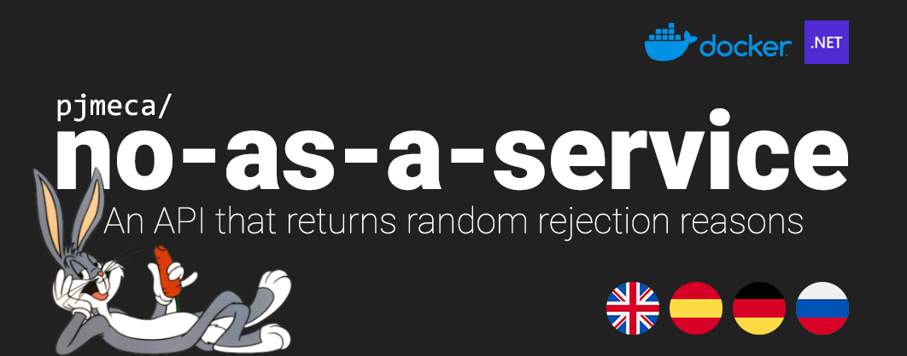

<p align="center">
  
</p>

[](https://github.com/pjmeca/no-as-a-service)
[](https://hub.docker.com/r/pjmeca/no-as-a-service)

Ever needed a graceful way to say “no”?
This tiny API returns random, generic, creative, and sometimes hilarious rejection reasons — now fully rewritten in **.NET 10** with **Native AOT** support for minimal runtime overhead and **pre-serialized JSON** for ultra-fast responses.

Built for humans, excuses, humor, and lightning-fast deployments!


## 🚀 API Usage

**Base URL** (if self-hosted via Docker):
```
https://naas.pjmeca.com
```
**Endpoints:**
* `GET /langs`: retrieves a JSON array with a list of all the available languages.
* `GET /no`: retrieves a funny "no" response in plain text.

**Rate Limit:** 120 requests per minute per IP (configurable in the code).

**Cache:** the `/no` endpoint uses `Cache-Control: no-store` to avoid proxy caching.

### 🔄 Example Request
```http
GET /no?lang=es
```

Response (plain text):

```txt
Not even if there were free donuts.
```

Use it in apps, bots, landing pages, Slack integrations, rejection letters, or wherever you need a polite (or witty) no.

### 🌍 Multi-language support

This version supports **multiple languages**, selectable via the `lang` query parameter:

```http
GET /no?lang=en
GET /no?lang=es
GET /no?lang={code}
```

A full list of available languages can be retrieved by callin the `/langs` endpoint.

If no `lang` parameter is provided, *English* is used by default.

Each language has its own text file inside the `reasons/` directory, making it easy to add new languages without changing any code.

### 🙏 Acknowledgements

Special thanks to [akicool](https://github.com/akicool) for contributing the German (`de`) and Russian (`ru`) translations in [PR #51](https://github.com/hotheadhacker/no-as-a-service/pull/51/commits/148ddca1c20fc30dd6fb3787baf9050b2a34286b) of the original repository.


## 🐳 Run with Docker (no setup required)

If you just want to run the API without building anything locally, a prebuilt image is available on Docker Hub.

```bash
docker run -p 5000:5000 pjmeca/no-as-a-service
```

The API will be available at:

```
http://localhost:5000
```

No Node.js, no .NET SDK, no build steps required.


## 🛠️ Self-Hosting

This .NET version is easy to run locally or in Docker.

### 1. Clone the repository

```bash
git clone https://github.com/pjmeca/no-as-a-service.git
cd no-as-a-service
```

### 2. Development (Windows / Rider / VSCode)

```bash
dotnet run
```

* Runs without Native AOT, fully debuggable.
* Access the API at `http://localhost:5000`.

### 3. Production / Docker (Native AOT)

```bash
docker build -t pjmeca/no-as-a-service .
docker run -p 5000:5000 pjmeca/no-as-a-service
```

* Produces a single, optimized native binary.
* Lightweight image ready for fast deployments.
* API available at `http://localhost:5000`.


## 📁 Project Structure

```
NoAsAService/
├── Program.cs          # Minimal API in .NET 10
├── reasons/            # One text file per language with rejection lines
├── NoAsAService.csproj
├── Dockerfile
└── README.md
```


## ⚓ Development Notes

* "Reasons" are loaded directly from text files.
* Static endpoints (`/` and `/langs`) are **pre-serialized** for ultra-fast responses.
* `Cache-Control: no-store` is applied to the `/no` endpoint to avoid proxy caching.
* Rate limiting is per IP (or `CF-Connecting-IP` when behind Cloudflare).
* Native AOT disables reflection-based JSON serialization; source-generated `AppJsonContext` is used.


## 👤 Author

Forked and maintained by [pjmeca](https://github.com/pjmeca), adapted from [hotheadhacker](https://github.com/hotheadhacker).

<a href="https://www.flaticon.com/packs/countrys-flags" title="flag icons">Flag icons created by Freepik - Flaticon</a>.


## 📄 License

MIT — do whatever, just don’t say yes when you should say no.
